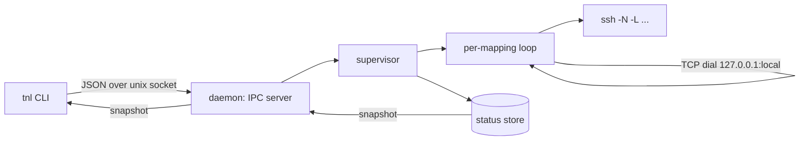

# tnl — SSH Tunnel Manager

A daemon-based SSH tunnel manager. Declare tunnels in a YAML config; tnl spawns your system `ssh` binary for each port mapping and supervises it — restarting dead mappings with exponential backoff, detecting port collisions, and giving you per-tunnel lifecycle control through a Unix-socket daemon.

Inspired by [tunn](https://github.com/strandnerd/tunn): same architecture (config → one `ssh` process per mapping → daemon + IPC), own codebase, plus supervision and lifecycle control tunn lacks.

## Features

- **YAML config** (`~/.tnlrc`): tunnels with multiple port mappings, optional display labels
- **Native ssh**: spawns the system `ssh`, so keys, agents, and `~/.ssh/config` behave exactly like your shell
- **Parallel execution**: every mapping runs concurrently
- **Supervision**: dead mappings restart with exponential backoff (1s → 60s cap, jittered); attempt counts surface in status
- **Connection-death detection**: `ServerAliveInterval`/`ServerAliveCountMax` keepalives turn dead TCP connections into process exits the supervisor sees — no autossh
- **Real liveness**: a mapping is `active` only when its local port accepts TCP connections
- **Port-collision detection**: occupied local ports are reported per-mapping and retried with backoff; two tunnels claiming the same port is rejected at config load
- **Lifecycle control**: `start`/`stop`/`restart` individual tunnels without touching the daemon; `enabled: false` excludes a tunnel from "start everything"
- **Daemon mode**: background daemon with Unix-socket IPC, pid/socket/log files, stale-state cleanup
- **Login integration** (macOS): `tnl install` registers a LaunchAgent that starts the daemon at login

## Requirements

- Go 1.26+ (to build)
- OpenSSH client (`ssh`)
- macOS or Linux (unix only in v1)

## Install

For an installed binary, use the Go toolchain:

```sh
go install github.com/ahmadaidin/tnl/cmd/tnl@latest
```

The binary is placed in `$(go env GOBIN)`, or `$(go env GOPATH)/bin` when
`GOBIN` is unset. Ensure that directory is on your `PATH`.

For a local checkout, build into `./bin` instead (also: `task build`):

```sh
go build -o bin/tnl ./cmd/tnl
# optional: pin a version string
go build -ldflags "-X github.com/ahmadaidin/tnl/internal/version.Version=v0.1.0" -o bin/tnl ./cmd/tnl
```

## Configuration

Create `~/.tnlrc` (or pass any path with `-c`):

```yaml
tunnels:
  pg_dev:
    host: myserver          # ssh host alias from ~/.ssh/config
    ports:
      - 3000:3000           # local:remote port mapping
      - repl: 4000:4001     # optional label: the app on that port
    enabled: true           # optional, default true
    user: pguser            # optional, overrides ~/.ssh/config
    identity_file: ~/.ssh/id_rsa  # optional

  db:
    host: database
    ports:
      - postgres: 5432:5432
    enabled: false          # declared but not started by default
```

Each `ports` entry is a plain `local:remote` spec (the remote port lives on the ssh host), a `local:desthost:remote` spec to forward to a host reachable *through* the ssh host, or a single-pair map `label: local:remote` to give the mapping a display name (the app listening on it):

```yaml
tunnels:
  dbsiakad:
    host: siakad.tech
    user: aidin
    reclaim: true      # kill the occupant of a colliding local port (same-user only)
    ports:
      - MySQL: 3306:mysql:3306   # forward through siakad.tech to mysql:3306
```

`reclaim: true` (per tunnel, off by default) makes the supervisor terminate whatever process is listening on a colliding local port instead of waiting for it to free. It only kills processes owned by your user (uid guard), sends SIGTERM with a 2s grace before SIGKILL, and logs the action; unkillable or foreign processes fall back to `error - port in use`.

Validation (all at load time, strict — unknown fields are rejected):

- `host` required; each tunnel needs at least one port mapping
- Port specs must be `local:remote` (or `local:desthost:remote`) with valid ports (1–65535); the label form is `label: <spec>` (one pair per entry)
- Two tunnels claiming the same `local` port is an error naming both tunnels
- `identity_file` undergoes env expansion

## Usage

```
Usage: tnl [options] [tunnel ...]

SSH tunnel manager. By default, tnl starts tunnels in the foreground.

Commands:
  tnl [names]            start tunnels in the foreground
  tnl -d [names]         start tunnels in a background daemon
  tnl status             show daemon and tunnel status
  tnl start [names]      start tunnels through the daemon
  tnl stop               stop the daemon
  tnl stop <name>        stop a single tunnel
  tnl restart <name>     restart a single tunnel
  tnl install            register tnl as a macOS launch agent
  tnl uninstall          remove the macOS launch agent
  tnl version            print the version

Options:
  -d, --detach           run as a background daemon
  -c, --config <path>    config file (default ~/.tnlrc)
  -h, --help             show this help
```

Examples:

```sh
tnl                       # run all enabled tunnels in the foreground
tnl pg_dev db             # run a subset in the foreground
tnl -d                    # start the daemon
tnl status                # per-tunnel/per-mapping state
tnl start pg_dev          # start a tunnel (auto-starts the daemon if needed)
tnl stop db               # stop one tunnel; it will not restart
tnl restart pg_dev        # stop, reset attempts, start fresh
tnl stop                  # stop the daemon
```

Explicit tunnel names always win: `tnl start pg_dev` works even when the tunnel has `enabled: false`. A bare `tnl` while the daemon is running errors instead of launching a second supervisor.

Status output (from a live run):

```
[api] web [connecting]
[db] 32000:5432 [backing off] (attempt 3)
[clash] 33000:80 [error] - port 33000 in use
```

## How supervision works

- A mapping is **Wanted** when its tunnel is enabled (or explicitly started) and not manually stopped. Only Wanted mappings restart.
- On spawn: the local port is probed. Occupied → `error - port N in use`, no spawn, but backoff retries keep trying, so the mapping recovers when the port frees. With `reclaim: true` on the tunnel, the supervisor instead terminates the occupant (same-user only, SIGTERM → 2s → SIGKILL) and takes the port.
- After spawn the mapping is `connecting`; it becomes `active` once `127.0.0.1:<local>` accepts TCP connections.
- Process exit while Wanted → attempt counter increments, backoff delay (`min(60s, 1s * 2^(attempt-1))` with ±20% jitter), respawn. After 5 attempts the message flips to `failed - retrying with backoff`; retries continue indefinitely.
- Stop or daemon shutdown: `SIGINT` to each ssh child, 2s grace, then `SIGKILL`. The daemon does not exit until every child is gone.

The spawned ssh command is (with `local:desthost:remote` mappings, `localhost` is replaced by the destination host):

```
ssh -N -L <local>:localhost:<remote> -o ServerAliveInterval=30 -o ServerAliveCountMax=3 -o ExitOnForwardFailure=yes [-i <identity>] [-l <user>] <host>
```

## Runtime files

The daemon keeps its state in `$XDG_RUNTIME_DIR/tnl` (fallback `~/.cache/tnl`), created `0700`:

- `daemon.pid` — daemon PID, used to prevent duplicate launches (stale entries cleaned on detection)
- `daemon.sock` — Unix socket for IPC commands, `0600`
- `daemon.log` — aggregated daemon and supervision logs

All files are removed when the daemon exits cleanly. The daemon is also self-sufficient against lost runtime files: if `daemon.pid` or `daemon.sock` are removed from underneath it (e.g. by external cleanup), it re-creates them within ~5s, so it never becomes invisible to `tnl status`/`tnl stop` and a duplicate daemon can never be launched.

## Login integration (macOS)

`tnl install` writes `~/Library/LaunchAgents/com.ahmadaidin.tnl.plist` (pointing at the current binary, `RunAtLoad`) and loads it. `KeepAlive` is deliberately `false`: launchd never resurrects the daemon after `tnl stop`. `tnl uninstall` unloads and removes it. On non-macOS these commands error with a clear message. The plist bakes in the binary path — re-run `tnl install` after moving or rebuilding the binary elsewhere.

## Architecture



Packages:

| Package | Role |
|---|---|
| `internal/config` | parse/validate `~/.tnlrc` |
| `internal/status` | thread-safe mapping-state store |
| `internal/supervisor` | supervision loops, backoff, spawn, probes |
| `internal/daemon` | unix-socket IPC, pid/socket/log lifecycle |
| `internal/cli` | argument parsing |
| `internal/output` | status rendering |
| `internal/launchd` | macOS LaunchAgent (darwin-only) |
| `cmd/tnl` | entrypoint and command dispatch |

## Design notes

- **No autossh** — the daemon owns the supervision state machine; ssh keepalives convert dead connections into process exits. See `docs/adr/0001-in-process-supervision.md`.
- **Own config format** — deliberately not tunn-compatible (`local:remote` specs with optional `label:` entries). See `docs/adr/0002-own-config-format.md`.
- Domain language (Tunnel, Mapping, Wanted, Connecting, Active, Backing off, Label) is defined in `CONTEXT.md`.

## Development

```sh
go build ./...
go test ./...
go test -race ./internal/supervisor/ ./internal/daemon/
```

A `Taskfile.yml` wraps the common flows: `task check` (vet + test + build), `task race`, `task smoke` (end-to-end daemon run against a fake ssh shim), `task run -- <args>` (run the built binary, e.g. `task run -- -d -c .tnlrc.yaml`), `task install`, `task clean`. Build with a version string via `task build VERSION=v0.1.0`.

Unit and integration tests never require a real sshd: they use an executable fake-ssh shim (`internal/testutil/fakessh.sh`, env-driven via `FAKE_SSH_LOG`/`FAKE_SSH_EXIT_IMMEDIATE`) and an injectable port prober. A manual smoke run looks like `XDG_RUNTIME_DIR=$(mktemp -d) PATH=<fakebin>:$PATH bin/tnl -d -c <config>` with a fake `ssh` on PATH.
